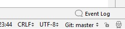

# First Step 
    for Windows machines
* Install JDK11
  * URL: https://www.oracle.com/technetwork/java/javase/downloads/jdk11-downloads-5066655.html
* Install GIT
  * URL: https://github.com/git-for-windows/git/releases/tag/v2.19.1.windows.1
  * Optional: Ensure you have an vaid SSH key-pair in the folder '%UserProfile%\\.ssh\' and copy your public key into your GitHub profile under 'SSH and GPG keys'
  * Clone this repository into an appropirate projects root folder
* Install community version of InelliJ
  * URL: https://www.jetbrains.com/idea/download/#section=windows

# Second Step 
Open the project within the IDE
 execute the maven in the command line with targets: 
 > clean install site -Dmaven.test.failure.ignore=true
 
To ensure the IDE all dependencies and plugins are loaded from the repositories.
After successful maven build the target/site/ folder should contain the project build and the java doc reports.

# Third Step 
## Branch form Git
Open the projekt with your InelliJ IDE and press on 'Git master' in the lower right corner of the IDE 
see:
>  

In the popup appear, click 'New Brach' and name it.
Now you are in private feature branch, feel free to change everything you like, 
and play around.
## Lambdas and Streams
Have a look into the class [LambdasAndStreams](https://github.com/TillWohlatz/TraningJDK11MavenProject/blob/master/src/main/java/com/zanox/internal/training/LambdasAndStreams.java)
and play around with it.
## Nested classes
Here an other interesting topic in java development [OuterAndInnerClasses](https://github.com/TillWohlatz/TraningJDK11MavenProject/blob/master/src/main/java/com/zanox/internal/training/OuterAndInnerClass.java)
## JUnit  5
Example Junit 5 Test drawn from [JUnit Guid](https://junit.org/junit5/docs/current/user-guide/) can be found [here](https://github.com/TillWohlatz/TraningJDK11MavenProject/blob/master/src/test/java/com/zanox/internal/training/models/DocumentTestResultsExampleTests.java)

